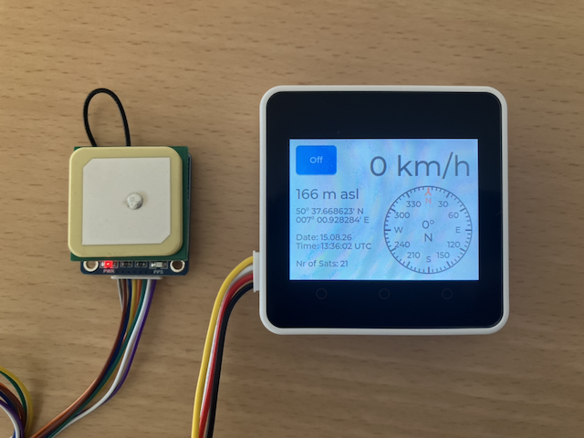

# CORE2 GNSS Display

This project uses an M5STACK CORE2 V1.1 SoC together with a Waveshare LC76G GNSS Module to display Satellite data.



On the left side of the picture you see the Waveshare LC76G GNSS Module and on the right side the CORE2 V1.1 SoC, which displays the satellite data.

The display shows 

on the left from top to bottom:

* a button to power off the system
* the altitude im meters above sea level: 166 m asl
* the latitude: 50° 37.668623' N
* the longitude: 007° 00.928284' E
* the date: 15. August 2026
* the time: 13:36.02 UTC
* the nr of satellites: 21

on the right:

* the velocity in km/h
* a compass showing the direction of movement

The Waveshare LC76G GNSS Module receives the satellite signals and as soon as it has enough information it signals the availability on a PPS (puls per second) pin and transmits the data through a UART connection to the SoC.
 
The standard setting of the LC76G is to send one puls per second. The standard baud rate of the UART is 115200 baud.

In this project we do not need to transmit commands to the LC76G GNSS module, because we use the standard configuration. Therefore we only have to connect four lines and we can use the Grove port on the CORE2 SoC:

| LC76G GNSS Module | Port A of CORE2 | Connection information                    |
|:------------------|:----------------|:------------------------------------------|
| VCC               | 5V              | 5V                                        |
| GND               | G               | Ground                                    |
| PPS               | G32             | connected to a GPIO button for PPS signal |
| TX                | G33             | connected to RX line of UART              |

The project uses the component `elrebo-de/generic_button` to listen for the PPS signal.

For every PPS signal a BUTTON_SINGLE_CLICK event is triggered and the function `ppsSignalCb`
 is called.

To receive the GNSS data it uses the component `elrebo-de/generic_uart`. 

To power off the system it uses the I2C functionality of ESP-IDF.

``` log
I (541) main_task: Calling app_main()
I (1041) CORE2 GNSS Display: Configure GenericUart gnssUart
I (1041) gnssUart: constructor
I (1041) gnssUart: UART_HW_FIFO_LEN(2): 128
I (1041) CORE2 GNSS Display: Configure GenericButton ppsSignal
I (1041) ppsSignal: Button Type GPIO
I (1051) button: IoT Button Version: 4.1.7
I (1051) ppsSignal: RegisterCallbackForEvent called
I (1051) CORE2 GNSS Display: Configure Display
I (1061) LVGL: Starting LVGL task
W (1061) i2c.master: Please check pull-up resistances whether be connected properly. Otherwise unexpected behavior would happen. For more detailed information, please read docs
I (1111) M5Stack: Install panel IO
I (1111) M5Stack: Install LCD driver
I (1111) ili9341: LCD panel create success, version: 2.0.2
I (1271) M5Stack: Setting LCD backlight: 50%
I (1511) CORE2 GNSS Display: Callback for PPS signal called!
I (1611) CORE2 GNSS Display: speed: 0, angle: 0, altitude: 0, latitude: , longitude: , date: , time: , nrOfSats: 0
I (14541) CORE2 GNSS Display: Callback for PPS signal called!
I (14541) CORE2 GNSS Display: speed: 0, angle: 0, altitude: 0, latitude: , longitude: , date: 15.08.26, time: 14:02:03, nrOfSats: 0
I (15541) CORE2 GNSS Display: Callback for PPS signal called!
I (15641) CORE2 GNSS Display: speed: 0, angle: 0, altitude: 167, latitude: 50° 37.664873' N, longitude: 007° 00.895127' E, date: 15.08.26, time: 14:02:17, nrOfSats: 16
I (16541) CORE2 GNSS Display: Callback for PPS signal called!
I (16641) CORE2 GNSS Display: speed: 0, angle: 0, altitude: 167, latitude: 50° 37.665239' N, longitude: 007° 00.895877' E, date: 15.08.26, time: 14:02:18, nrOfSats: 18
I (17541) CORE2 GNSS Display: Callback for PPS signal called!
I (17641) CORE2 GNSS Display: speed: 0, angle: 0, altitude: 167, latitude: 50° 37.665336' N, longitude: 007° 00.898356' E, date: 15.08.26, time: 14:02:19, nrOfSats: 18
I (18541) CORE2 GNSS Display: Callback for PPS signal called!
I (18641) CORE2 GNSS Display: speed: 0, angle: 0, altitude: 167, latitude: 50° 37.665143' N, longitude: 007° 00.899717' E, date: 15.08.26, time: 14:02:20, nrOfSats: 19
I (19541) CORE2 GNSS Display: Callback for PPS signal called!
I (19641) CORE2 GNSS Display: speed: 0, angle: 0, altitude: 167, latitude: 50° 37.665408' N, longitude: 007° 00.901805' E, date: 15.08.26, time: 14:02:21, nrOfSats: 19
I (20541) CORE2 GNSS Display: Callback for PPS signal called!
I (20641) CORE2 GNSS Display: speed: 0, angle: 0, altitude: 167, latitude: 50° 37.665851' N, longitude: 007° 00.904751' E, date: 15.08.26, time: 14:02:22, nrOfSats: 18
I (21541) CORE2 GNSS Display: Callback for PPS signal called!
I (21641) CORE2 GNSS Display: speed: 0, angle: 0, altitude: 167, latitude: 50° 37.665977' N, longitude: 007° 00.906959' E, date: 15.08.26, time: 14:02:23, nrOfSats: 18
I (22541) CORE2 GNSS Display: Callback for PPS signal called!
I (22641) CORE2 GNSS Display: speed: 0, angle: 0, altitude: 167, latitude: 50° 37.666241' N, longitude: 007° 00.908651' E, date: 15.08.26, time: 14:02:24, nrOfSats: 18
I (23541) CORE2 GNSS Display: Callback for PPS signal called!
I (23641) CORE2 GNSS Display: speed: 0, angle: 0, altitude: 167, latitude: 50° 37.666415' N, longitude: 007° 00.909731' E, date: 15.08.26, time: 14:02:25, nrOfSats: 18
I (24541) CORE2 GNSS Display: Callback for PPS signal called!
I (24641) CORE2 GNSS Display: speed: 0, angle: 0, altitude: 167, latitude: 50° 37.666607' N, longitude: 007° 00.910841' E, date: 15.08.26, time: 14:02:26, nrOfSats: 18
I (25541) CORE2 GNSS Display: Callback for PPS signal called!
I (25641) CORE2 GNSS Display: speed: 0, angle: 0, altitude: 167, latitude: 50° 37.666775' N, longitude: 007° 00.911507' E, date: 15.08.26, time: 14:02:27, nrOfSats: 19
I (26151) CORE2 GNSS Display: PowerOff button clicked!
I (26151) CORE2 GNSS Display: AXP2101 I2C interface successfully established via esp_bsp!
I (26151) CORE2 GNSS Display: Power Off!
```
In this log we see the following:

* at timestamp 1511 (after 1.5 sec.) the PPS signal callback was triggered -> no useful data received
* at timestamp 14541 (after 14.5 sec.) the PPS signal was triggered the second time -> now date and time are set
* at timestamp 15541 (after 15.5 sec.) the PPS signal was triggered again, now positioning information is available from 16 satellites
* at timestamp 16151 (after 16 sec.) the Off button was pressed -> power is switched off

