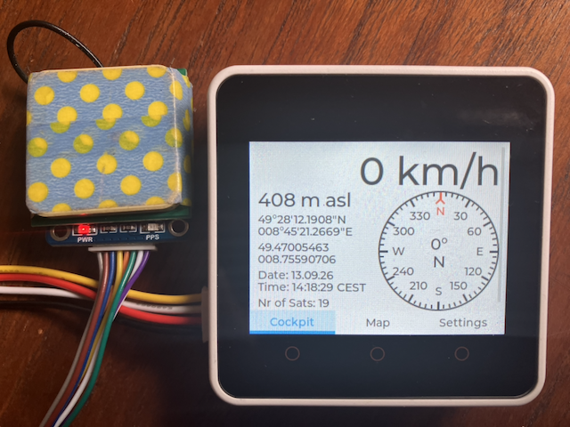
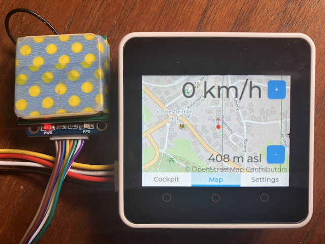
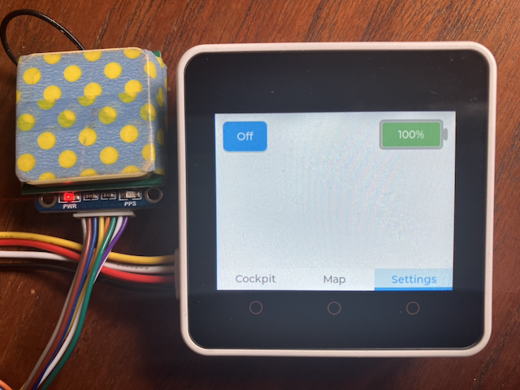

# CORE2 GNSS Display

This project uses an M5STACK CORE2 V1.1 SoC together with a Waveshare LC76G GNSS Module to display Satellite data.



On the left side of the picture you see the Waveshare LC76G GNSS Module and on the right side the CORE2 V1.1 SoC, which displays the satellite data in the Cockpit tabview.

The Cockpit view shows 

on the right from top to bottom:

* the velocity in km/h
* a compass showing the direction of movement

on the left from top to bottom:

* the altitude im meters above sea level: 408 m asl
* the latitude and longitude in degrees, minutes and seconds: 49°28'12.1908"N and 008°45'21.2669"E
* the latitude and longitude in degrees: 49.47005463 and 008.75590706
* the local date: 13.09.26
* the local time: 14:18:29 CEST
* the nr of satellites: 19

The Map view can be activated by pressing the tab "Map".



The Map view shows an OpenStreetMap with a marker at the current location. The map data must be available on the SD card in the CORE2.

The direction of movement is shown with a darkred arrow at the marker position.

The velocity and altitude are shown as well. 

With the `+` and `-` buttons on the right side the map can be zoomed in and out.

The "Settings" view can be activated by pressing the tab "Settings".



Currently no settings can be set, but the system can be powered off with the "Off" button at the top left corner.

At the top right a battery and charging indicator is shown.

The Waveshare LC76G GNSS Module receives the satellite signals and as soon as it has enough information it signals the availability on a PPS (puls per second) pin and transmits the data through a UART connection to the SoC.
 
The standard setting of the LC76G is to send one puls per second. The standard baud rate of the UART is 115200 baud.

In this project we do not need to transmit commands to the LC76G GNSS module, because we use the standard configuration. Therefore we only have to connect four lines and we can use the Grove port on the CORE2 SoC:

| LC76G GNSS Module | Port A of CORE2 | Connection information                    |
|:------------------|:----------------|:------------------------------------------|
| VCC               | 5V              | 5V                                        |
| GND               | G               | Ground                                    |
| PPS               | G32             | connected to a GPIO button for PPS signal |
| TX                | G33             | connected to RX line of UART              |

The project uses the component `elrebo-de/generic_button` to listen for the PPS signal.

For every PPS signal a BUTTON_SINGLE_CLICK event is triggered and the function `ppsSignalCb`
 is called.

To receive the GNSS data it uses the component `elrebo-de/generic_uart`. 

To power off the system it uses the I2C functionality of ESP-IDF.

``` log
I (1553) main_task: Calling app_main()
I (2063) CORE2 GNSS Display: Configure local timezone
I (2063) CORE2 GNSS Display: Configure GenericUart gnssUart
I (2063) gnssUart: constructor
I (2063) gnssUart: UART_HW_FIFO_LEN(2): 128
I (2063) CORE2 GNSS Display: Configure SD card
W (2073) i2c.master: Please check pull-up resistances whether be connected properly. Otherwise unexpected behavior would happen. For more detailed information, please read docs
W (2233) M5Stack: Warning: Long filenames on SD card are disabled in menuconfig!
I (2233) sdspi_transaction: cmd=52, R1 response: command not supported
I (2273) sdspi_transaction: cmd=5, R1 response: command not supported
I (2293) CORE2 GNSS Display: SD card successfully mounted at /sdcard!
I (2293) CORE2 GNSS Display: Configure AXP2101 PMU
I (2293) CORE2 GNSS Display: AXP2101 PMU Detected (M5Stack Core2 v1.1)
I (2303) CORE2 GNSS Display: I2cMaster
I (2303) CORE2 GNSS Display: I2cDevice AXP2101 PMU
I (2313) CORE2 GNSS Display: AXP2101 I2C interface successfully established via esp_bsp!
I (2313) CORE2 GNSS Display: Configure Display
PSRAM successfully activated! Free storage: 4155272 Bytes
I (2323) CORE2 GNSS Display: Configure GenericButton ppsSignal
I (2333) ppsSignal: Button Type GPIO
I (2333) button: IoT Button Version: 4.1.7
I (2343) LVGL: Starting LVGL task
I (2373) M5Stack: Install panel IO
I (2373) M5Stack: Install LCD driver
I (2373) ili9341: LCD panel create success, version: 2.1.0
I (2943) map_tiles: Map tiles initialized with base path: /sdcard, 1 tile types, current type: esp_sd_tiles, zoom: 16, grid: 3x3
I (3023) basic_map_display: Map display initialized
I (3023) basic_map_display: Loading map for GPS: 52.470230, 9.756270
I (3033) map_tiles: GPS to tile: tile_x=34543, tile_y=21506, offset_x=19, offset_y=192
W (3153) map_tiles: Tile not found: /sdcard/esp_sd_tiles/16/34543/21506.bin
W (3153) basic_map_display: Failed to load tile 0 (34543, 21506)
W (3273) map_tiles: Tile not found: /sdcard/esp_sd_tiles/16/34544/21506.bin
W (3273) basic_map_display: Failed to load tile 1 (34544, 21506)
W (3403) map_tiles: Tile not found: /sdcard/esp_sd_tiles/16/34545/21506.bin
W (3403) basic_map_display: Failed to load tile 2 (34545, 21506)
W (3523) map_tiles: Tile not found: /sdcard/esp_sd_tiles/16/34543/21507.bin
W (3523) basic_map_display: Failed to load tile 3 (34543, 21507)
W (3643) map_tiles: Tile not found: /sdcard/esp_sd_tiles/16/34544/21507.bin
W (3643) basic_map_display: Failed to load tile 4 (34544, 21507)
W (3773) map_tiles: Tile not found: /sdcard/esp_sd_tiles/16/34545/21507.bin
W (3773) basic_map_display: Failed to load tile 5 (34545, 21507)
W (3893) map_tiles: Tile not found: /sdcard/esp_sd_tiles/16/34543/21508.bin
W (3893) basic_map_display: Failed to load tile 6 (34543, 21508)
W (4013) map_tiles: Tile not found: /sdcard/esp_sd_tiles/16/34544/21508.bin
W (4013) basic_map_display: Failed to load tile 7 (34544, 21508)
W (4143) map_tiles: Tile not found: /sdcard/esp_sd_tiles/16/34545/21508.bin
W (4143) basic_map_display: Failed to load tile 8 (34545, 21508)
I (4143) basic_map_display: Map tiles loaded for location
I (4163) ppsSignal: RegisterCallbackForEvent called
I (4163) CORE2 GNSS Display: Battery Voltage: 4101 mV, Charge State: Charging(2) (86 %)
W (4433) basic_map_display: GPS position outside inner half of outer tiles, reloading map
I (4433) basic_map_display: Loading map for GPS: 49.470039, 8.755991
I (4433) map_tiles: GPS to tile: tile_x=34360, tile_y=22374, offset_x=250, offset_y=118
I (4973) basic_map_display: Loaded tile 0 (34360, 22374)
I (5473) basic_map_display: Loaded tile 1 (34361, 22374)
I (5893) basic_map_display: Loaded tile 2 (34362, 22374)
I (6393) basic_map_display: Loaded tile 3 (34360, 22375)
I (6883) basic_map_display: Loaded tile 4 (34361, 22375)
I (7303) basic_map_display: Loaded tile 5 (34362, 22375)
I (7803) basic_map_display: Loaded tile 6 (34360, 22376)
I (8283) basic_map_display: Loaded tile 7 (34361, 22376)
I (8703) basic_map_display: Loaded tile 8 (34362, 22376)
I (8703) basic_map_display: Map tiles loaded for location
I (34173) CORE2 GNSS Display: Battery Voltage: 4105 mV, Charge State: Charging(2) (86 %)
I (64173) CORE2 GNSS Display: Battery Voltage: 4110 mV, Charge State: Charging(2) (87 %)
```

# Known problems

* currently, the initial coordinates have to be set in the program code
* system crashes unpredictably (potentially because of storage leaks) after about 20 minutes

# Next steps

* improve storage model

## Cockpit view

## Map view

## Settings view

* set Timezone
* set initial zoom level
