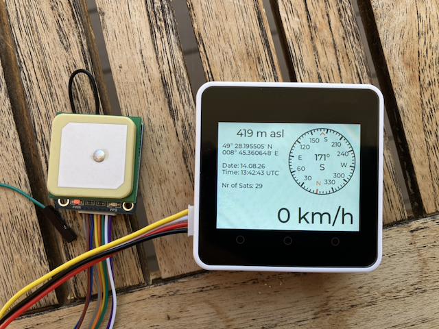

# CORE2 GNSS Display

This project uses an M5STACK CORE2 V1.1 SoC together with a Waveshare LC76G GNSS Module to display Satellite data.



On the left side of the picture you see the Waveshare LC76G GNSS Module and on the right side the CORE2 V1.1 SoC, which displays the satellite data.

The display shows 

on the left from top to bottom:

* the altitude im meters above sea level: 419 m asl
* the latitude: 49° 28.195505' N
* the longitude: 008° 45.360648' E
* the date: 14. August 2026
* the time: 13:42.43 UTC
* the nr of satellites: 29

on the right:

* a compass showing the direction of movement
* the velocity in km/h

The Waveshare LC76G GNSS Module receives the satellite signals and as soon as it has enough information it signals the availability on a PPS (puls per second) pin and transmits the data through a UART connection to the SoC.
 
The standard setting of the LC76G is to send one puls per second. The standard baud rate of the UART is 115200 baud.

In this project we do not need to transmit commands to the LC76G GNSS module, because we use the standard configuration. Therefore we only have to connect four lines and we can use the Grove port on the CORE2 SoC:

| LC76G GNSS Module | Port A of CORE2 | Connection information                    |
|:------------------|:----------------|:------------------------------------------|
| VCC               | 5V              | 5V                                        |
| GND               | G               | Ground                                    |
| PPS               | G32             | connected to a GPIO button for PPS signal |
| TX                | G33             | connected to RX line of UART              |

The project uses the component `elrebo-de/generic_button` to listen for the PPS signal.

For every PPS signal a BUTTON_SINGLE_CLICK event is triggered and the function `ppsSignalCb`
 is called.

To receive the GNSS data it uses the component `elrebo-de/generic_uart`. 

``` log
I (541) main_task: Calling app_main()
I (1041) CORE2 GNSS Display: Configure GenericUart gnssUart
I (1041) gnssUart: constructor
I (1041) gnssUart: UART_HW_FIFO_LEN(2): 128
I (1041) CORE2 GNSS Display: Configure GenericButton ppsSignal
I (1041) ppsSignal: Button Type GPIO
I (1051) button: IoT Button Version: 4.1.7
I (1051) ppsSignal: RegisterCallbackForEvent called
I (1051) CORE2 GNSS Display: Configure Display
I (1061) LVGL: Starting LVGL task
W (1061) i2c.master: Please check pull-up resistances whether be connected properly. Otherwise unexpected behavior would happen. For more detailed information, please read docs
I (1101) M5Stack: Install panel IO
I (1101) M5Stack: Install LCD driver
I (1101) ili9341: LCD panel create success, version: 2.0.2
I (1261) M5Stack: Setting LCD backlight: 100%
I (1941) CORE2 GNSS Display: Callback for PPS signal called!
I (2041) CORE2 GNSS Display: speed: 0, angle: 173, altitude: 415, latitude: 49° 28.206138' N, longitude: 008° 45.355541' E, date: 14.08.26, time: 13:04:10, nrOfSats: 25
I (2941) CORE2 GNSS Display: Callback for PPS signal called!
I (3041) CORE2 GNSS Display: speed: 0, angle: 173, altitude: 415, latitude: 49° 28.206138' N, longitude: 008° 45.355535' E, date: 14.08.26, time: 13:04:11, nrOfSats: 25
I (3941) CORE2 GNSS Display: Callback for PPS signal called!
I (4041) CORE2 GNSS Display: speed: 0, angle: 173, altitude: 415, latitude: 49° 28.206125' N, longitude: 008° 45.355541' E, date: 14.08.26, time: 13:04:12, nrOfSats: 25
I (4941) CORE2 GNSS Display: Callback for PPS signal called!
I (5041) CORE2 GNSS Display: speed: 0, angle: 173, altitude: 415, latitude: 49° 28.206125' N, longitude: 008° 45.355530' E, date: 14.08.26, time: 13:04:13, nrOfSats: 25
I (5941) CORE2 GNSS Display: Callback for PPS signal called!
I (6041) CORE2 GNSS Display: speed: 0, angle: 173, altitude: 415, latitude: 49° 28.206113' N, longitude: 008° 45.355523' E, date: 14.08.26, time: 13:04:14, nrOfSats: 25
I (6941) CORE2 GNSS Display: Callback for PPS signal called!
I (7041) CORE2 GNSS Display: speed: 0, angle: 173, altitude: 415, latitude: 49° 28.206107' N, longitude: 008° 45.355523' E, date: 14.08.26, time: 13:04:15, nrOfSats: 25
I (7941) CORE2 GNSS Display: Callback for PPS signal called!
I (8041) CORE2 GNSS Display: speed: 0, angle: 173, altitude: 415, latitude: 49° 28.206095' N, longitude: 008° 45.355523' E, date: 14.08.26, time: 13:04:16, nrOfSats: 25
I (8941) CORE2 GNSS Display: Callback for PPS signal called!
I (9041) CORE2 GNSS Display: speed: 0, angle: 173, altitude: 415, latitude: 49° 28.206066' N, longitude: 008° 45.355547' E, date: 14.08.26, time: 13:04:17, nrOfSats: 25
I (9941) CORE2 GNSS Display: Callback for PPS signal called!
I (10041) CORE2 GNSS Display: speed: 0, angle: 173, altitude: 415, latitude: 49° 28.206041' N, longitude: 008° 45.355577' E, date: 14.08.26, time: 13:04:18, nrOfSats: 25
```

